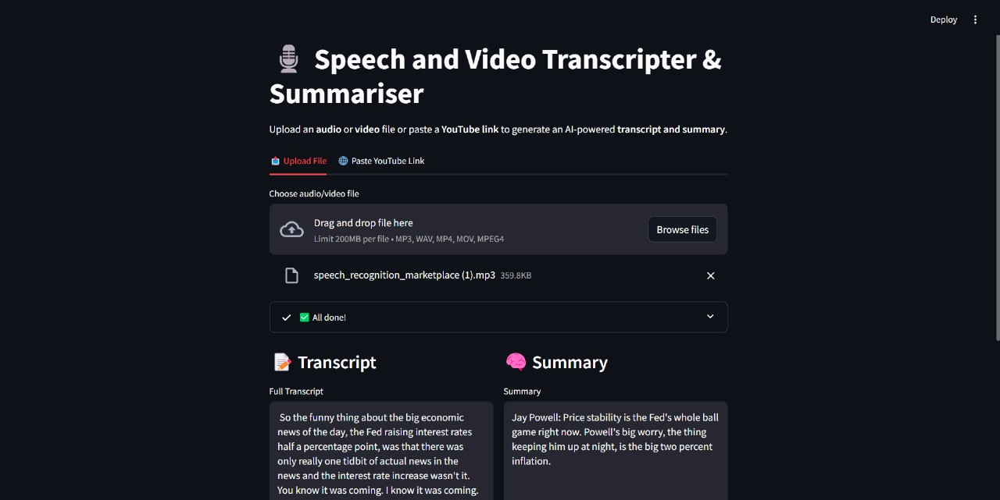

markdown
# 🎧 Speech and Video Transcripter & Summariser

An AI-powered Streamlit web application that transcribes audio/video files or YouTube videos and generates concise summaries using state-of-the-art models like OpenAI Whisper and BART.

## 🚀 Features

- 📤 Upload audio/video files (`.mp3`, `.wav`, `.mp4`, `.mov`)
- 🌐 Paste a YouTube video link for direct transcription
- 📝 Auto-transcription using OpenAI Whisper (`tiny` model for fast inference)
- 🧠 Text summarization using Facebook's `bart-large-cnn` model
- ⚡ Real-time progress indicators with Streamlit UI
- 🧹 Automatic file cleanup after processing

## 🛠 Tech Stack

- Python
- Streamlit
- Whisper by OpenAI
- HuggingFace Transformers (BART model)
- PyDub
- MoviePy==1.0.3
- yt-dlp


## 📸 Example Screenshot



## 📁 Project Structure


├── app.py                 # Streamlit app
├── uttils.py              # Utility functions (transcription, summarization)
├── requirements.txt       # Python dependencies
├── README.md              # Project documentation


## 📦 Installation

1. Clone the repository:

bash
git clone https://github.com/poornamushigeri/Speech_Transcriptor.git
cd Speech_Transcriptor


2. (Optional) Create a virtual environment:

bash
python -m venv venv
source venv/bin/activate  # or venv\Scripts\activate on Windows


3. Install the dependencies:

bash
pip install -r requirements.txt


4. Download required Whisper model:

bash
python -c "import whisper; whisper.load_model('tiny')"


5. Run the Streamlit app:

bash
streamlit run app.py


## 🌐 Live Demo

[🔗 Click here to view the deployed app on Render](https://your-render-app-url.onrender.com)

## 📦 Deployment on Render

1. Push your code to a GitHub repository.
2. Create a new Render Web Service from your repo.
3. Set the start command to:

bash
streamlit run app.py --server.port=10000


4. Add a `requirements.txt` file (if not already present) with:


streamlit
transformers
pydub
moviepy
yt-dlp
whisper
torch
```

5. Set build environment to Python 3.x and deploy.